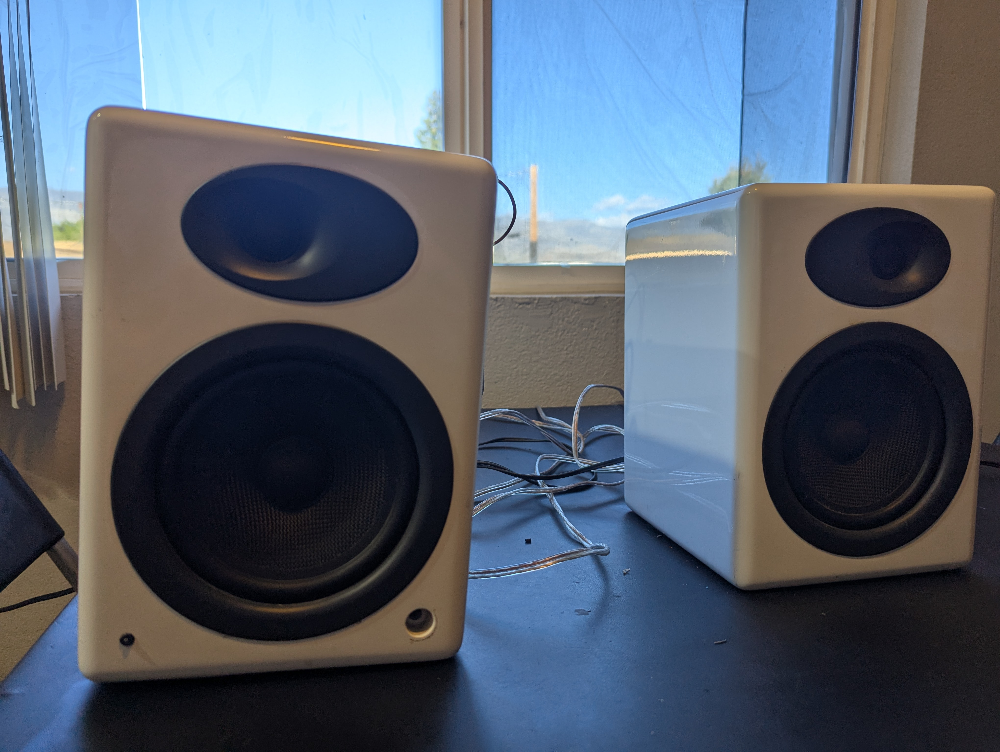
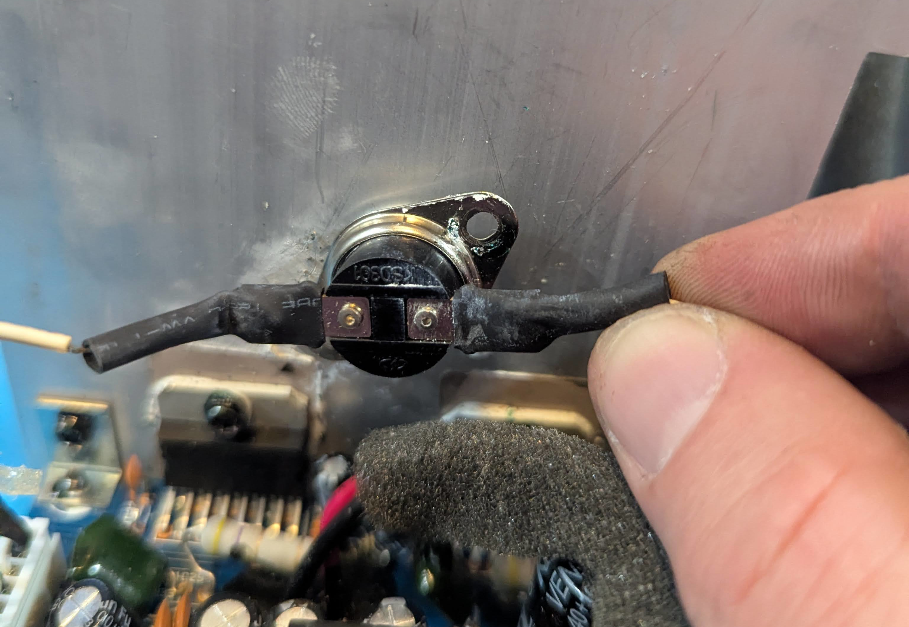
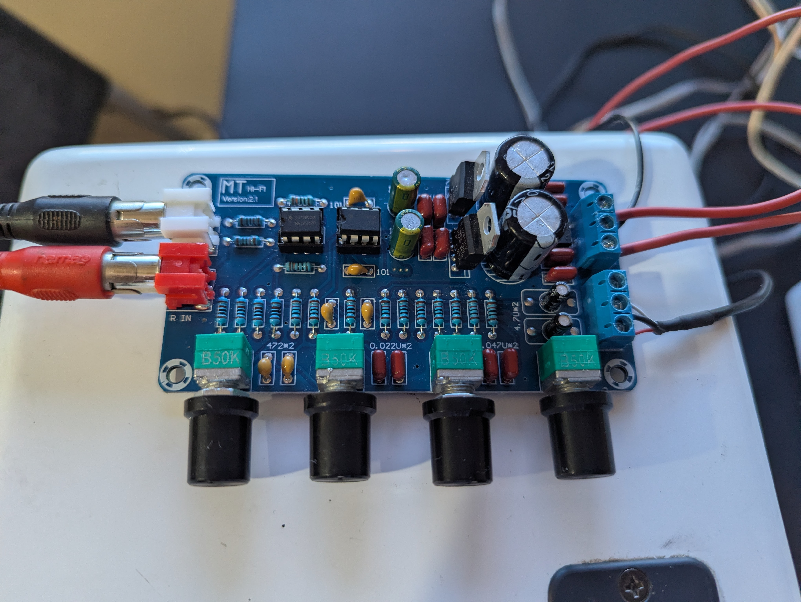
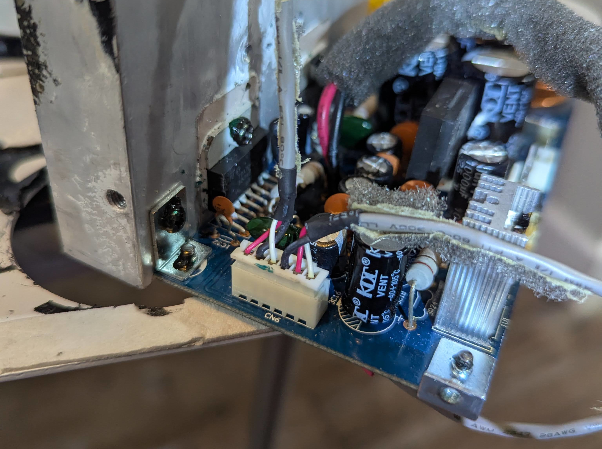
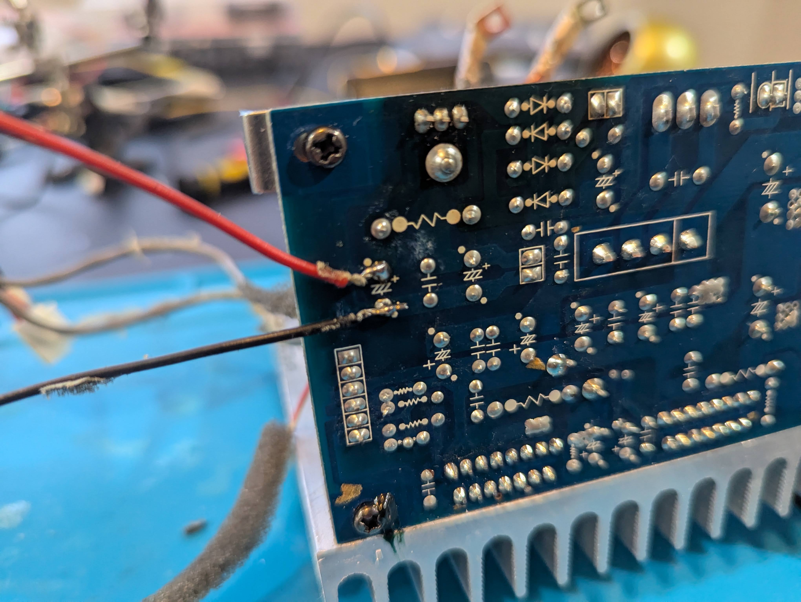
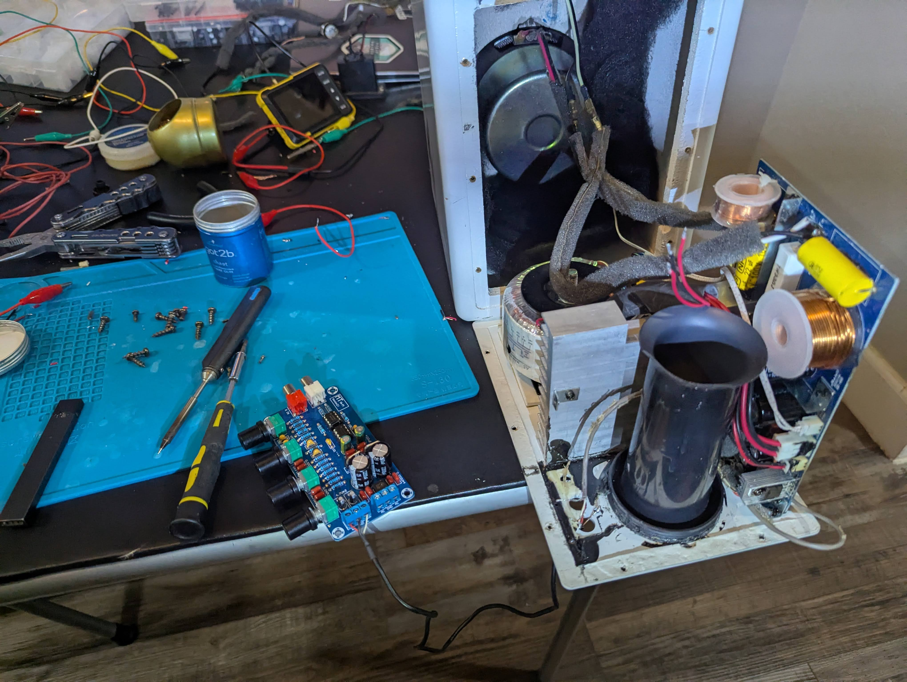
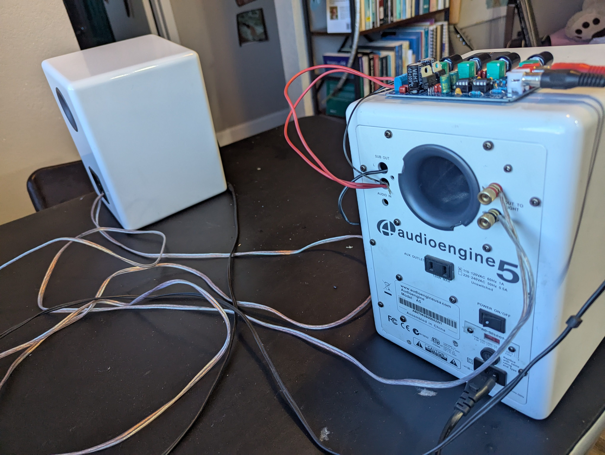

## Intro
So I had this pair of Audioengine A5+ for almost 10 years and I love them.
They are a pretty fun story. I bought them on Amazon as "used" for pretty cheap (300 USD). They arrived and didn't work. So I chatted with Amazon customer service and they offered that I should have them repaired rather than returned and gave me a refund of 110 USD to cover the repairs. I've never seen this before or after, but it's a pretty perfect scenario for someone who loves taking things apart. The repair was disappointingly simple though. Somehow the screws holding the amplifier in place must have come loose. The amplifier was just dangling around in the speaker with some cables having ripped of. So it was just reattaching cables and screwing it all back in.

So when I saw a pair of Audioengine A5 (not plus) in a dumpster a few months back, I was quite excited and hoping it would be similarly trivial to repair. And it almost was ...

## A "Thank you!!!" to Limpkin's blog
But it was simple only because there are people on the internet who actually know what they are doing and share their knowledge. In this case, an incredible guy named Mathieu Stephan, aka Limpkin, who operates an amazing blog at [https://www.limpkin.fr](https://www.limpkin.fr).

In his blog post titled ["Repairing a Pair of Audioengine A5 Speakers"](https://www.limpkin.fr/index.php?post/2023/09/03/Repairing-a-pair-of-Audioengine-A5-speakers) he pinpoints the issue with his speaker relatively quickly to the part he calls the "Input Stage Board", which I guess is a glorified preamplifier handling inputs from the top-and the back 3.5 mm jacks as well as providing an optional subwoofer output. Another cool thing this board does is receive input from a thermocouple attached to the heat sink of the power amplifier, presumably for it to shut down or reduce volume when the power transistors get too warm.

Being an electrical engineer, Mathieu did not only understand that the issue was with the "input stage board". He identified a single capacitor being shot, was able to replace it, and fixed his pair of speakers at a total parts cost in the cent range. For a quick second, I considered doing the same, but with my non-existent electronics knowledge, I had no idea if my speakers even had the same issue (or assess if they did). I also remembered how dick-fingered I was and how unlikely I'd be able to get the capacitor soldered off and on without breaking everything.

## Diagnosis
I did not know for sure that for my speakers, the issue was with the preamplifier too, but here was my thought process:

- I ruled out issues with the speakers themselves. They looked fine and I could drive them with my other audioengine amplifier.
- I ruled out the transformer too; all voltages checked out. Also, the LED did light up (though only very faintly).
- This left the issue with the preamplifier or the power amplifier. I did not have an oscilloscope then (I since got a super small and cheap one. What an amazing device!!), so I couldn't test the preamplifier output. But as I was futzing around, touching things I shouldn't, I was able to produce semi-loud static (probably 60 Hz) noises on the speakers, leaving me to believe that the power amp works just fine.
- Most importantly, another random dude on the internet had issues with his preamplifier, so that was my best guess too.

Missing the knowledge and aptitude to fix the preamplifier, I figured the best way for me was to replace it.

## Picking a preamplifier
I was confused for quite some time that there were 6 cables going from the preamplifier to the amplifier (two white, two black, two red) while all preamplifiers I saw online obviously only had three outputs (Left, Ground, and Right). Re-reading Limpkins blog, I saw he was confused for a second as well, but figured the second set of three cables were for Ground, Mute, and Standby.

The speaker has no central rectifier and the amplifier and preamplifier boards deal with their own rectification. So that means, I needed an AC-powered preamplifier. The transformer has three outputs: a 12 V tap, a 18 V center-tapped, and a 24 V center-tapped output/rail. So I opted for a 12 V to 18 V AC preamplifier.

## Installing the preamplifier
Hooking up the new preamplifier theoretically was simple, but I was confused about two things:

- Since I had ripped out the connecting cables from the preamplifier, I was not fully sure which set of cables were R, G, L, and which were S, M, G. They were only labeled on the preamplifier output, not on the power amplifier input (always take pictures before ripping apart kids).
- The new preamplifier board said 12 V to 18 V. But it has a center-tapped input. So I wasn't sure if this was supposed to mean 12/18 V to ground or 12/18 V across the two phases. Apparently, it means to ground since it didn't blow up when I connected it to the 18 V rail (with 36 V across).

Which one is which!?

## No output
Kudos to Limpkin for building the contraption to feed a function generator signal to a 3.5 mm jack. But missing a function generator myself, I used a much simpler setup: a 3.5 mm audio cable connected to the output of my laptop and a YouTube audio/video of a 440 Hz sine wave.

In the meantime, I bought an oscilloscope and could see the signal both at the output of the new preamplifier and the power amplifier (/speaker) output. This reassured me that I found which of the 6 cables were R, G, and L.
However, I had two disappointing observations:
- The amplitude was lower at the power amplifier output than on the preamplifier output.
- The signal at the power amplifier (/speaker) output dropped to zero when I connected the speakers.

For a while, I was concerned that actually the power amplifier was shot (read ... "that I broke it in the process"), but it seemed unlikely that both right and left didn't work. Also, I occasionally produced semi-loud static when I touched the wrong things.

... And then I remembered the mute and standby pins ...

Sine wave fed from laptop/youtube through 3.5 mm audio cable to the preamplifier and appearing on the oscilloscope hooked up to the amplifier output

## The mute pin
So my theory was that the power amplifier was by default in mute or even standby. I actually don't think there is a "user interface" to trigger either since there are no buttons and no remote control. So probably just a consequence of modular part standardization.

In my simple mind, you'd trigger e.g. unmute by either grounding the pin (is this what they call "pull-down" and should be done through a high resistance resistor?), or setting it to a specific voltage (is this then called "pulling up"?). The further can be ruled out quickly since there is no potential between the mute pin and the ground ... and connecting the mute pin to ground doesn't do anything (oh how I wish I was a diligent person and had actually assessed this in the stated order).

So applying a constant voltage it is. But where to find a DC voltage on the board? I first tried the pins for the USB charging (5 V), which resulted in a very distorted signal. But a signal it was. So success!

I then probed around on the board to find two pins with 12 V potential and found it at one of the transistors. Soldered cables to those pins and hooked them up to the mute button. And then there it was: The pure sound of a middle C, the amplified 440 Hz sine wave loudly audible.

Random pins on the board with 12 V across.

## Final thoughts
Figuring out that the issue was with the mute pin took up 50% of the time. I would have saved myself a lot of time, had I
- taken more pictures before ripping things apart.
- read Limpkin's blog post one more time

The new preamplifier glued to the top of the speaker may have some aesthetic but definitely is a bit unpractical. I also don't care for the equalizer knobs, so I may shop around for a nicer option.

It is a tiny bit worrisome that I do not have the thermocouple anymore to shut down the speakers when the amp may overheat. The speaker has a heat sink inside the box, which is less than ideal. The A5+ has cooling ribs outside, and even then, I got them to overheat quite a few times and actually attached an external fan to them.

Putting it back together

Backside
