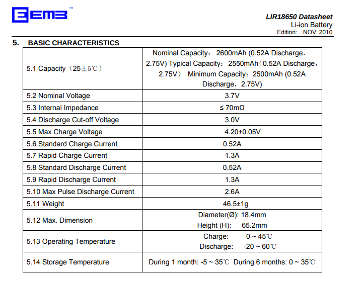

## Intro

### Jabra Rant
I cannot say that I am too impressed with Jabra. I had a ton of different products over the years and all but one was pretty underwhelming. The one who heeps trooping is a 15-year-old Revo, which survived multiple raptures and superglue repairs and for which I even found replacement ear pads a year ago.

By contrast, by far the most disappointing was the (200 USD!!) Evolve 2, which crapped out after a few months (wouldn't charge anymore) and the customer service just said "Sorry, your one-month warranty is over, you are shit out of luck. Bye". Jabra, being a Dutch company and all, could never fly with that in their home country, where the European Union enforces a two-year legal warranty for consumer goods.

Finding the correct replacement battery for the Elite Pro was also impossible; I couldn't even find the part number. Again, this does not speak too highly of Jabra.

After giving up finding the actual correct replacement battery, I switched to looking for just any battery small enough, which is an annoying task since the dimensions are rarely provided on the landing page. I ended up buying a battery meant for the Bose QC35. While searching around, I actually came across tons of Bose replacement batteries and made a note in my head to probably choose Bose the next time I am shopping for headphones.

The part number was AHB110520 (or maybe AHB110520CPS or MH10048-E7?)

### Context
Anyway; I had this set of Jabra Elite Pro for just a little over a year and noticed the battery of the case giving out. Wasn't a big deal since the charge in the buds themselves tended to last long enough for my use and they'd still charge as long as the case was plugged in.

At some point, the battery in the case must have completely broken and the buds wouldn't charge even when the case was plugged in.

Changing Lithium-Ion batteries in devices is usually super easy and I have tons of small ones farting around from all the disposable vapes I keep founding on the streets. They are all single-cell and thus all have the same nominal voltage (3.7 V) and only differences in energy capacity (the mAh / Wh) and form factor.

### Thoughts on battery specs
NB: I never quite understood why the capacity is given in mAh. It's an electric charge rate times time, i.e. an electric charge. So why not use the SI base unit, coulomb, for it? I am also wondering how the charge is determined. I'd assume the charge in the battery between its maximum voltage (4.2 V) and some cutoff voltage (maybe 3 V?). Apparently, there is no industry-wide defined cutoff voltage to determine a battery's charge. However, IEC 61960 does specify that a battery datasheet has to specify the cutoff value.

Then again, I guess what we really care for is actually the energy content, which would be said charge times the voltage. I guess I increasingly see that on the labels of batteries. Strangely enough given in Watt hours, i.e. an energy rate (aka power) unit times a time unit rather than in an energy unit. But maybe that's more understandable since we are used to it in the context of electricity and power where energy is traded and sold in units of MWh and kWh.

It's also worthwhile wondering if the energy contents are simply the electric charge times the nominal voltage or if it is somehow the integrated power under a given load. From all I can see in the advertised stats, it is always nominal power times electric charge.

## The actual replacement

Prying off the rubber

Rubber removed

Battery unplugged

Unscrew the battery holder. It was a torx T5 bit.

The battery in its holder removed

The battery removed from the holder.

Old battery. The numbers on it yielded nothing in an internet search.

Soldered the new battery onto the old connector.

Packed back in. The new battery didn't fit into the holder, so I stuck it in without it.
A bit of wiggling around to get the rubber back in flush.

